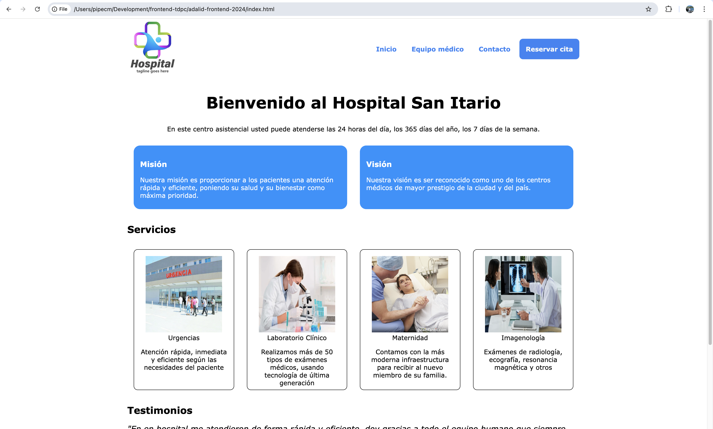

# Sitio Web Hospital San Itario
Repositorio que contiene la capa de front-end del sitio web del Hospital San Itario.

## Alumno
Felipe Cárdenas Molina

## Estructura
El sitio web se encuentra estructurado de la siguiente forma:

```
├── README.md
├── contact.html
├── images
│   ├── hospital_logo.png
│   ├── laboratory.webp
│   ├── location.png
│   ├── maternity.jpg
│   ├── medico_01.jpg
│   ├── medico_02.jpg
│   ├── medico_03.jpg
│   ├── medico_04.webp
│   ├── radiology.jpg
│   └── urgency.webp
├── index.html
├── staff.html
└── styles
    └── style.css
```

|Directorio|Contenido                   |
|----------|----------------------------|
|/ (raíz)  | Ficheros HTML              |
|images    | Imágenes del sitio         |
|styles    | Ficheros de estilos CSS    |

## Despliegue local
Para desplegar el sitio en su ambiente local, se debe realizar lo siguiente:

1. Clonar el repositorio del sitio web:
```
git clone git@github.com:pipecm/adalid-frontend-2024.git
```

2. Acceder a la carpeta recientemente descargada:
```
cd adalid-frontend-2024
```

3. Ejecutar el comando para instalar las dependencias de Bootstrap:
```
npm install
```

4. Ejecutar el comando que imprime el directorio actual:
```
pwd
```

5. Copiar el resultado obtenido, abrir un browser y pegar la ruta obtenida, seguido de `/index.html`, por ejemplo:

```
/home/myself/development/adalid-frontend-2024/index.html
```

Si todo lo anterior se realizó correctamente, se debería visualizar el sitio web como en la imagen siguiente:



## Vistas
|Página                         |Funcionalidad                            |
|-------------------------------|-----------------------------------------|
|[index.html](index.html)       |Home del sitio, contiene la información principal del hospital (misión, visión, servicios, etc.                   |
|[staff.html](staff.html)       |Equipo médico del hospital, especialidades y experiencia relevante.                                 |  
|[contact.html](contact.html)   |Formulario de contacto                 |

## Aplicación de SASS y BEM
Con el fin de presentar de forma más ordenada los estilos de los diversos elementos del sitio web, se renombraron varios de los estilos usando la convención BEM (Bloque-Elemento-Modificador). Asimismo, se generó el CSS por medio del preprocesador SASS, usando lenguaje SCSS en cada componente.

## Estructura SASS
|Componente     |Descripción                                 |
|---------------|--------------------------------------------|
|[base](styles/components/_base.scss)|Contiene los estilos base del sitio completo|
|[contact](styles/components/_contact.scss)|Contiene los estilos para el formulario de contacto y mapa de ubicación|
|[footer](styles/components/_footer.scss)|Contiene los estilos para el footer (links rápidos, info de contacto y copyright)|
|[header](styles/components/_header.scss)|Contiene los estilos de la barra superior, logo y links|
|[services](styles/components/_services.scss)|Contiene los estilos aplicados a la grilla de servicios del hospital|
|[staff](styles/components/_staff.scss)|Contiene los estilos aplicados a la grilla de médicos del hospital|
|[testimonials](styles/components/_testimonials.scss)|Contiene los estilos de los testimonios de los pacientes|
|[welcome](styles/components/_welcome.scss)|Contiene los estilos de la sección de bienvenida, misión y visión|
|[mixins](styles/components/_mixins.scss)|Contiene los mixins aplicados en el sitio|

## Mixins
Se creó un mixin que setea el tamaño y layout de los elementos de las grillas de servicios del hospital y del equipo médico, usando como parámetros su altura y ancho.

## Integración de Bootstrap
Con el fin de darle una apariencia más profesional al sitio y para efectos de aprendizaje de la herramienta, se aplicó Bootstrap en los siguientes componentes:
- Botones de reserva de cita y envío de formulario
- Tarjetas "Misión" y "Visión"
- Formulario de contacto

## Event Loop de JavaScript
El Event Loop de JavaScript consiste en un mecanismo añadido por un entorno determinado de JavaScript, el cual permite que una aplicación no se bloquee mientras espera una respuesta.

### Funcionamiento

En primer lugar, se ejecutan todas las tareas que se encuentren en el call stack, es decir, las tareas que no dependen de componentes asíncronos como por ejemplo `setTimeout()` o `Promise`. Por otro lado, las tareas asíncronas son enviadas a la cola (callback queue) de tareas, ya sea de forma inmediata (Ej: promises) como diferida (una vez que el tiempo de `setTimeout()` haya transcurrido). Si en algún momento el call stack se encuentra vacío, éste toma la primera tarea que se encuentre en la callback queue para ejecutarla.

## Uso de prompts

Al hacer click en el botón `Registro` ubicado en el costado superior izquierdo, se invoca a un prompt que solicita secuencialmente datos personales como nombre, email y teléfono del usuario. Tales datos son validados comparándose contra expresiones regulares (regex) adecuadas, en particular:

* Se valida que el nombre tenga sólo letras
* Se valida que el email siga el formato correcto (user@mail.com)
* Se valida que el teléfono tenga sólo números

Cada vez que no se ingrese un dato correcto, se lanza un `alert()` que avisa de tal situación y se vuelve a ejecutar el prompt respectivo. Si en algún momento se presiona el botón `Cancelar`, se termina la ejecución de los prompts.

## Scope de variables

Los datos personales del usuario de momento sólo permanecen en el contexto del método `register()` presente en `app.js`. Ellos se manejan en variables declaradas con `let`, mientras que las funciones y los valores que permanecen constantes se declararon usando `const`. 

## Uso de debugger

Para usar el debugger, se debe colocar la palabra reservada `debugger` en cada punto del código donde se desee detener parcialmente la ejecución, y luego seguir el flujo de ejecución en la zona de inspección del browser (se debe hacer click en el botón para reanudar la ejecución hasta el siguiente `debugger` o hasta el final, según sea el caso).

## Uso de try/catch para manejar errores

En `app.js` se lanzan errores cada vez que se ingresen datos incorrectos en los prompts, de manera que en la sección principal del código tales errores sean capturados para lanzar los mensajes de error respectivos con `alert()`.

## Changelog
2024-11-09  Entrega ejercicio práctico Nº 1

2024-11-10  Entrega ejercicio práctico Nº 2

2024-11-11  Entrega ejercicio práctico Nº 3

2024-12-07  Entrega taller 2 del módulo 3


© 2024 Hospital San Itario. Todos los derechos reservados